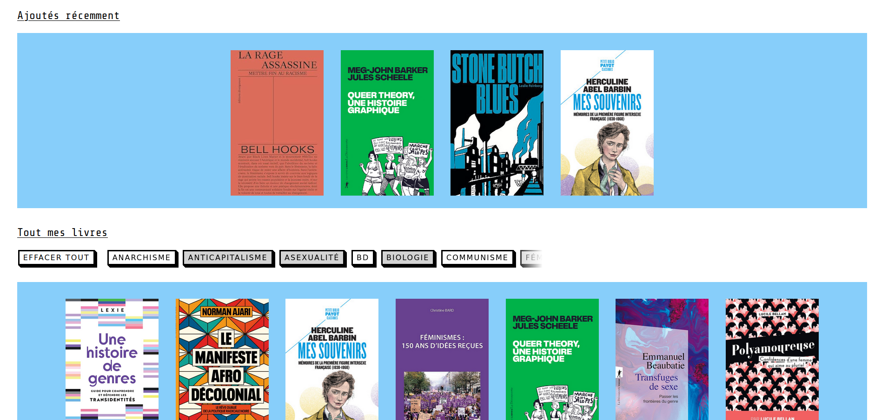
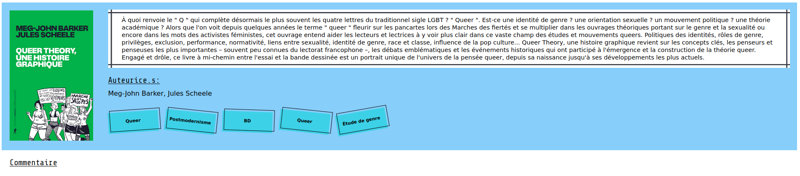

# The Camilibrary project

This project is a website that will be able to show every book that I ever read
on the subject of gender studies and related fields.
Moreover, it will be developped in Django as I wanted to learn this framework
for quite some time now.

||
|:-------------------------:|
| *home page* |

||
|:-------------------------:|
| *Information about a book* |

# Run

To run the project in developpement mode, you just have to go in the project's
folder and run ```python(3) manage.py runserver```