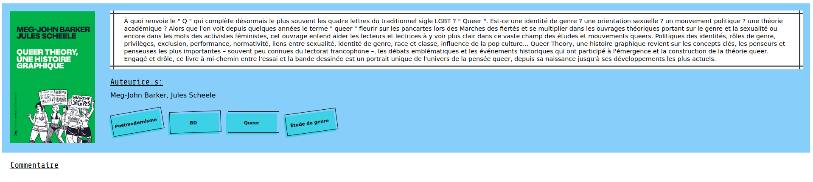

# The Camilibrary project

This project is a website that will be able to show every book that I ever read
on the subject of gender studies and related fields.

This Project is developped using Django as I wanted to learn this framework for
quite a while now. Moreover, I'm using [cotton](https://django-cotton.com/) to
bring component-based design to django.

||
|:-------------------------:|
| *home page. This image was edited to show the pagination.* |

||
|:-------------------------:|
| *A book's information* |

# Run

## Dependencies

- Django 4.2.17 (python -m pip install Django)
- Cotton 1.5.1 (pip install django-cotton)

To run the project in developpement mode, you just have to go in the project's
folder and run ```python(3) manage.py runserver```