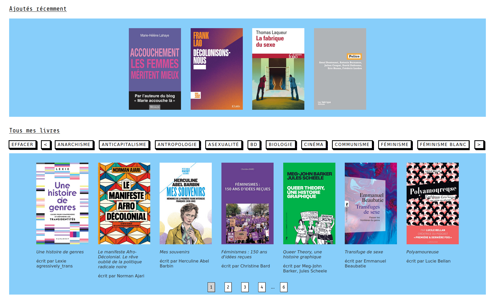

# The Camilibrary project

This project is a showcase website that index every book I ever read
on the subject of gender studies and related fields. It is accessible at this
adress : [Camilibrary.fr](https://www.camilibrary.fr).

This Project is developped using Django as I wanted to learn this framework for
quite a while now. Moreover, I'm using [cotton](https://django-cotton.com/) to
bring component-based design to django.

||
|:-------------------------:|
| *home page. This image was edited to show the pagination.* |

||
|:-------------------------:|
| *home page with the " Philosophie " filter activated.* |

||
|:-------------------------:|
| *A book's information* |

# Dependencies

- Django 4.2.17 (python -m pip install Django)
- Cotton 1.5.1 (pip install django-cotton)
- Django-cors-headers 4.7.0 (pip install django-cors-headers)

# Local

To run the project in developpement mode, you just have to go in the project's
folder and run ```python(3) manage.py runserver```

# Production

This part of the doc supposes that you will use caddy and gunicorn to handle
the server-side as it is the infrastructure that I use myself.\
Big thanks to Thomas Feldmann and chrisadams for their tutorial - [here](https://tfeldmann.de/blog/serving-django-with-caddy/)
and [here](https://rtl.chrisadams.me.uk/2023/01/til-using-caddy-with-django-apps-instead-of-nginx/) respectively -
on how to serve django with caddy which helped me (although I had issues with
venv that they couldn't have known XD).

To install the project in production, clone the project in /var/www/ and then do
the following.

## venv

Please note that depending on your system, you may want to install your python
modules in a venv. It could be the case that your server host won't let you pip
globally as it was the case for me. For example, I recieved this error on using
pip install :
> error: externally-managed-environment\
× This environment is externally managed\
╰─> To install Python packages system-wide, try apt install\
    python3-xyz, where xyz is the package you are trying to\
    install.

However, cotton isn't reckognized by such a command (python3-django-cotton) thus
rendering our global installation incomplete (do not mix global and venv install)

If such is the case (or similar), please first create a venv in the git project
```shell
cd /var/www/Camilibrary
mkdir venv
python3 -m venv ./venv
```

Then, create aliases in ~/.profile for easier typing,
```shell
add -> alias pythonv="/var/www/Camilibrary/venv/bin/python3"
add -> alias pipv="/var/www/Camilibrary/venv/bin/pip"

```
do not forget to source your file !

## Server-side

First, install caddy as described [here]() and pip install gunicorn and other
python dependencies globally or within a venv as nedded.
We will then create the config files for our processes to run.

- Create or modify a caddyfile of the following form in ```/etc/caddy/Caddyfile```

```
[your IP] {

	encode zstd gzip

	handle {

		reverse_proxy localhost:3000
	}

	handle_path /static/* {

		root * /var/www/Camilibrary/staticfiles
		file_server
	}

	# Set this path to your site's directory.
	#root * /var/www/Camilibrary

	# Enable the static file server.
	#file_server
}
```

This way, caddy will act as a reverse proxy that will redirect demands to
localhost:3000 which will be the local ip that gunicorn will listen to.

- Create a gunicorn file gunicorn.conf.py of the following form in ```/var/www/Camilibrary```

```python
bind="localhost:3000"
workers=4
keepalive=5

wsgi_app="library.wsgi"
```

- Create a systemctl a gunicorn.service file of the following form in ```/etc/systemd/system/```

```
[Install]
WantedBy=multi-user.target

[Unit]
Description=Gunicorn service
After=network.target

[Service]
WorkingDirectory=/var/www/Camilibrary
ExecStart=[Your path to gunicorn]
```

⚠️ Beware ! If you are using a venv for gunicorn, you will have to put your
_absolute_ path to the git project; that is to say ```/var/www/Camilibrary/venv/bin/gunicorn```

The config files done, we can now create daemons for our process to work.

With the previous intstallation, caddy should be up and running. You can check that
by issuing the following command
```shell
sudo systemctl status caddy
```

Then, we can create our gunicorn daemon. This daemon will execute its script,
lunching gunicorn with its conf file that we created above.

```shell
sudo systemctl enable gunicorn.service
sudo systemctl start gunicorn.service
```

you can then check gunicorn status with ```sudo systemctl status gunicorn```.
If there's a 203 error, you have put the wrong path in ExecStart. If it is the 1
error, it should be an execution error, which means something in the gunicorn conf
file is not correct. This could be the case that wsgi_app is wrong for example
and you should use the name that [django](./library/settings.py) use in its settings
(minus the .application part).

## Django's case

When using django in production mode, one could regroup all static data into a
single folder for easier managment. This allow for django to fetch media in a
single folder, even for multiple apps that have their own /static folder !

This is the approach I am following, and thus, we still need one final step
before our configuration is complete. We need to create this global folder.
Remember, if you're using a venv as described above, you need to use the
pythonv alias !
```shell
cd /var/www/Camilibrary
python manage.py collectstatic
sudo systemctl restart gunicorn
```

When all of this is done, your website should be up and running, gg !